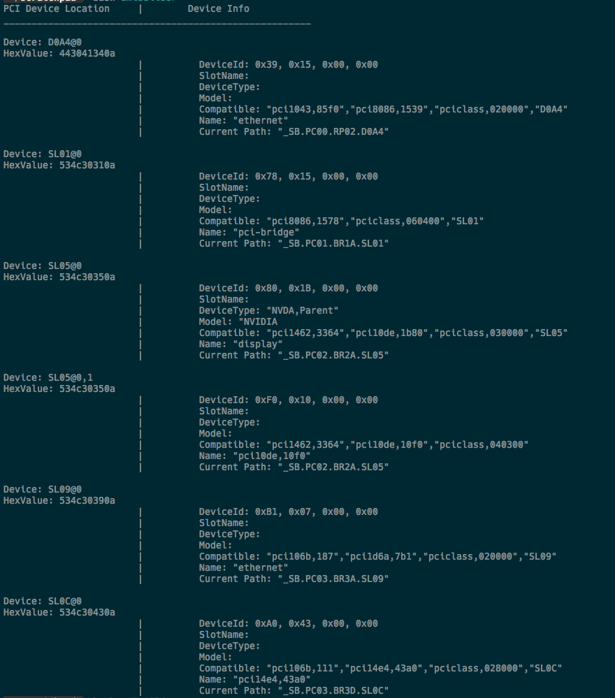

## AML Helper
This is a very basic script designed to help you identify PCI devices you will need to configure for your hack.
This script simply using IOReg to print out a list of PCI devices and relative info to them. This can be useful for when you need to determine the device name on your mainboard in order to translate it for Clover or aml configs.

To run this script:
 - clone this repository `git clone https://github.com/alexisaperez/amlHelper.git`
 - `cd amlHelper`
 - `chmod +x amlHelper.sh`
 - Before configuring your ACPI patches in clover you can run the script to get device names, ID's, model, etc.
 - `./amlHelper.sh`
 - The result will look like this.

 
 - Once you get copy the correct info to your AML and Clover config the next time you run the script it will look like the following.

 

## TODO
- Currently AML Helper attempts to build a sample AML to be consumed by your ACPI/Patched folder. This is WIP and needs more time to properly implement.
- AML Helper does not currently support devices other than PCI, this will take time to sort through. 
